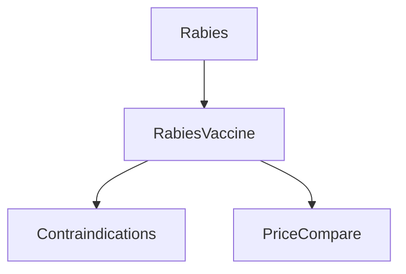
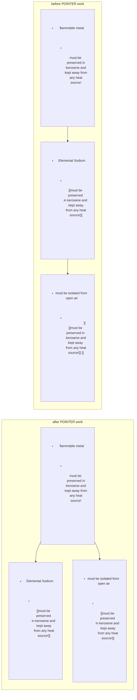
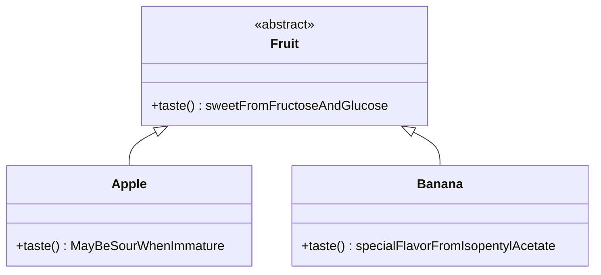

语言: [English](./Readme.md) | [简体中文](./README-zh_CN.md)

## 如何使用
- 该插件依赖一套`PowerUp` 工作
- ~~将这些 `PowerUp` 当作 `##tag` 使用就行~~ RN目前的版本已经无法手动添加PowerUp的tag，需要使用对应的指令给当前焦点下的Rem添加Tag。
  > \OIns: 标记为 `~Instance`
  > 
  > \OExt: 标记为 `~Extend`
  > 
  > \OPtr: 标记为 `~Pointer`
  > 
  > \OPrl: 标记为 `~Partial`
  > 
  > \ORwt: 标记为 `~Rewrite`
- 可以通过在一个rem上使用`/`指令 `clear OON tags` 清除这个插件对这一个Rem的影响

## 功能
- 为RemNote的模板系统提供一些powerUps，这些PowerUp带来了Java和C#等OOP语言部分特征，其作用类似于这些面向对象程序语言中的一些保留关键字。

## ”引用树“问题和此插件出现的原因
- RemNote内有时会出现这种现象：一个Rem的内容里面包含有对另一个Rem的引用，同时其他的Rem又引用了这一个包含有引用的Rem
- 
- 
- 

- Rem `[[Rabies]] vaccine （[[狂犬病]]疫苗）` 引用了Rem `Rabies （狂犬病）`
- The rem  `There are no contraindications to [[ [[Rabies]] Vaccination]], for any side effect is not comparable to death rabies can cause.([[[[狂犬病]]疫苗]]没有禁忌症，因为任何副作用都不能与狂犬病带来的死亡相提并论)`  and  `The price of the canine [[ [[Rabies]] Vaccination]] is one-tenth of vaccine for a human.（犬用[[[[狂犬病]]疫苗]]价格为人用疫苗的1/10）`   have references to the rem `[[Rabies]] vaccine` 
    - 注：为了更好地解释”引用树“，笔者在这里使用了类似于Roam的语法来表示引用，以嵌套在一个`[[ ]]` 中的另一个 `[[ ]]`表示对引用的引用
- 这个”引用树“看起来像下面这个样子


- 但有的时候会出现”引用链条“没有蕴含足够信息的情况，此时”引用树“会成为使用双向链接的障碍，”引用链条“需要被展平。
- 这里有一个关于单质钠和单质钾的简介，以及一个实验室守则的样例。
- 因为安全对于实验室至关重要，我希望"matters needing attention when preserving flammable metal（保存可燃金属的注意事项）"成为”Elemental Sodium（单质钠）“和 ”Elemental Potassium（单质钾）“的一个slot。
- 模板系统的一个功能是提醒你按照模板的规矩办事，防止你忘记某些关键步骤和关键因素。
  
- 但是笔者不想让带有相同内容的Rem散落在知识库的各个地方，害怕我无法在同一个地方（反向链接面板）找到所有引用这个Rem的其他Rem，然后忘记部分引用了这个Rem的其他Rem的存在。
  （或许您听说过”DRY/Don't repeat yourself(不要重复自己)“的编程原则，这是相通的，**笔者认为做笔记如同为你的意识编制程序，然后你在未来的某一天可以像调用API一样使用他们——这是这个插件的名字`Object Oriented Noting（面向对象笔记）`的由来**）
  - 于是笔者在`Elemental Sodium（单质钠）`这一Rem下面添加了一条引用，这条引用来自实验室守则中关于可燃金属的内容，并将`- [[must be preserved in kerosene and kept away from any heat source!]]（[[必须保存在煤油中并且远离一切热源！]]）`这一条Rem设置为slot。
  - 
  - 但当我使用这条含有引用的slot时,一个需要被展平的"不良引用树" 就出现了。
    - 
  - ”不良引用树“需要被展平，因为此时从实验室守则的条款（也就是真正的信息来源）的反向链接面板中，你只能找到一个引用了这一条款的Rem，而另一个Rem则引用了这个引用者本身。
    - 


###  为展平”引用树“而模仿C++的`Pointer/*`
- 通过将`引用链`转变为`引用分叉`，`Pointer`能够减小”引用树“的高度（深度）并展平”引用树“
- 
- 如下图所示，当标签 `##~pointer`被加载到一个Rem上的时候, ”引用树“的枝干从细长的”链条”变成了粗矮的“分叉”。你可以看到，“引用树”的高度从3降低到了2，这也意味着它被“展平”了。

- 此时你就可以在反向链接面板看到所有的两个引用该条款的Rem。
  
- 让我们重新理一下思路
  1. 我想让记录着安全守则条款的Rem成为在别处的记录着危险化学品`单质钠/钾`信息的Rem的slot 。
  2. 直接复制条款的纯文本到这些危险化学品下方有悖于`DRY/不要重复自己`的原则。
  3. 对条款进行引用并置为slot会产生“不良引用树”。
  4. 这就是为什么笔者会需要一个`Pointer` Rem, 我希望这对您也有帮助。

- 这是以前版本的README中的解释 ~~我就偷懒不翻译了~~
  > the Rem `[[Object1]]` ,which is tagged with `~Pointer`,  will guide other reference to itself (`[[ [[Object1]] ]]` ) to the rem it is  pointing to  ( turn `[[ [[Object1]] ]]` to `[[Object1]]`  )
  > 
  > This power up can converge reference to other templates' slot to the information source of the rem, assuring no redundant rems left.


### 为解决组合问题而模仿C#中的`Partial`
- 反向链接允许我们“到四处书写，在一处整理”，这只需要我们将反向链接portal（译注：portal原意为”传送门“，RemNote将块引用命名为portal，因为对portal中内容的更改将实时同步到portal所指向的rem——这个名称继承自RemNote团队所使用的React开发框架）中的rem直接拖到文档中。
  - `Partial`在此基础上更进一步，通过在使用模板系统时配合使用`Partial`,甚至连”在一处整理“的步骤都可以精简掉。
  - 当 "RemA" 打上 `Partial`标签时，插件会找到"RemA"所引用的其他所有Rem，然后给这些被"RemA"引用的Rem添加"RemA"拥有的全部slot。 
    
    - 呐，你现在可以看见这个实验室安全条款引用了Rem `Elemental Sodium（单质钠）` 和`Elemental Potassium（单质钾）`。当这个条款被 `~Partial`标记时，该条款下的所有slot将被加载到这两个Rem（`单质钠`和`单质钾`）上，这意味着插件会在`单质钠`和`单质钾`这两个Rem下面创建对该条款的引用。然后这两条引用本身也会成为slot 。
    - 这些被插件自动置为slot的引用将成为隐式的`Pointer`
      
    - 为什么这些对条款的引用本身也需要成为slot? 因为这些引用的创建，本就是实验安全条款`”附着“`在这两种可燃金属的简介上的结果。 
    - 哦，忘了补充一句，你能发现被打上`~Partial`标记的条款能把自己的slot同时”附着“在几个Rem上，这样就能避免违反`DRY/不要重复自己`的准则或者冒着破坏实验守则完整性的风险把条款分散在不同的实例中。（听起来像动态链接库DLL呢~）you can find that the clause tagged with `~Partial` can "attach" its slots to several rems in the meantime without violating the `DRY/Don't Repeat Itself` principle or moving the clause elsewhere which may be a detriment to the integrity of this lab regulation.
  -  `~Partial`这一PowerUp来源于C#的关键字`partial`, 这个词在C#中是一个类修饰符 (在这里以`Form1`为例), 提醒编译器将分散在不同文件的`Form1`的类的代码组合成一个完整的类，*这也可以被描述为” partial类 “ ”附着“到了`Form1`类的主干部分* 
```csharp
//由Visual Studio生成的Form1的其他内容位于其他文件夹。 
//这使得应用程序员可以专注于他们的业务代码。
//编译过程中所有同名的"partial类" 将合并为一个完整的类。
public partial class Form1 : Form
{
    public Form1()
     {
         InitializeComponent();
     }
}
 ```

当一个Rem (像下图中的 `New content added to     [[Class 1]]  and  [[Class 2]] （添加到[[类1]]和[[类2]]的新内容）` ) 被 `~Partial`标记,   **A** 的slot ( 比如下面例子中的   `New content added to     [[Class 1]]  and  [[Class 2]]   > Method 3（方法3）`  ) 会把所有对Rem**A**的slot的引用转变为Rem**A** 所指向的Rem的引用(就像下面例子中的 `[[  New content added to     [[Class 1]]  and  [[Class 2]]   > [[Method 3]]   ]] ` )


在RemNote启动或者被`~Partial`标记的Rem被编辑时， (像下面例子中的`New content added to     [[Class 1]]  and  [[Class 2]] `) , 被标记的Rem**A**拥有的slot会在插件的作用下，在被Rem**A**引用的Rem下添加对Rem**A**拥有的slot的引用。


### JS语言中的`Instance(of)` 和 `Extends(ing)` 
- 这两个PowerUps被用来区分`类`和`对象`，或者`定义`和`应用`，这些可能在把RemNote当作同时记录你的数学公式和具体的练习题的数学笔记本 which may be helpful when using RemNote as a math notebook to document the formula you learned and math exercise you did
- 举个 `instance（例子）`,
  1. ”牛顿-莱布尼兹公式“是一个 `class（类）`
  2. "格林公式" `extends（扩展/继承）` 了 "牛顿-莱布尼兹公式" ，成为了后者在二维函数时的表现
  3. 一个类似于"一只兔子沿着*y=sin(πx)*的轨迹从(0,0)跑到(1,0)。 它跑了多长的路程（不是位移）? " 是一个 `object(对象/实例)`
  4. 3当中的问题是使用了1进行求解的一个 `instance(of)` （例子）.
  5. 这意味着问题3当中的问题可以用`instance(of)`标记，以表明这是一个`练习题`，不是一个需要记忆的公式。
- ~~通过键入 `##~Instance` 或者 `##~Extending`就能添加tag使用对应的功能~~ 当前版本的RN已经无法手动添加PowerUp的tag了
- **通过键入斜线指令 `\ins` 或 `\ext`添加tag**
- 目前 ( 0.3.2版本)这些tag还没有添加特殊的附加功能. 这个tag和附带的slot只会在反向链接面板的排序中起到作用，或者您可以为 `class` and `Object`自行添加自定义CSS


### `Rewrite(Override)` in Java
- "Override/重写" 是一个用于调用面向对象语言的[多态](https://zhuanlan.zhihu.com/p/63878686)特性的关键词 .

- 一个抽象类 (像 `水果`) 像一个可以表示 `Apple（林檎）`, `Banana（香♂蕉）`, `Cheery（樱桃）`（~~陈瑞~~） 等各种具体水果的模板. `水果` 是抽象的因为你无法找到不属于任何一个具体水果种类的 `水果` 。

- 水果通常带有甜味但每一种具体的水果有其独有的具体味道. 


- 当一个Rem被标记为 `~Rewrite`时,它会找到所有它需要去覆写的Rem (被覆写者是被 `~Rewrite`标记的Rem所引用的其他Rem) 和 "所有者rem"(指出具体类名 ——`Apple`,`Banana` 或者 `Fruit`). 下面的例子中,覆写者的所有者是 `Apple` 和 `Banana`  而被覆写者的所有者是 `Fruit`.


- 当一个Rem (比如一个具体品种的苹果 `红富士`) 被覆写者的所有者标签 (比如：键入 `##Apple` 或 `##Banana` 以添加对应的标签)并添加被覆写者的所有者 `Fruit`的slots (RN有对”继承“的原生支持, 因为rem可以接触到所有先祖的slot), 在使用slot中添加的对被覆写的slot `taste():sweetFromFructoseAndGlucose`的引用会重定向到覆写者slot `taste():MayBeSourWhenImmature`, 这意味着 `红富士` 是一种苹果并拥有苹果独有的味道而不是水果一般的味道.


