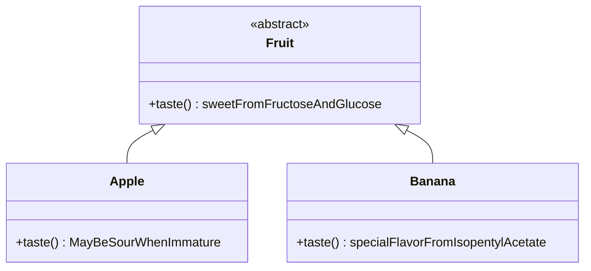

## How to use
- This plugin works with a set of powerUps.
- ~~You can use these powerUps just by using them as tags to utilize the plugin.~~ PowerUps cannot be used as tagged manually by `##PowerUps` and you can use slash command instead to attach corresponding PowerUp Tags to the focused Rems.
  > \OIns: Tag with `~Instance`
  > 
  > \OExt: Tag with `~Extend`
  > 
  > \OPtr: Tag with `~Pointer`
  > 
  > \OPrl: Tag with `~Partial`
  > 
  > \ORwt: Tag with `~Rewrite`
- You can use slash command `clear OON tags` to clear all OON tags attached to current focused rem.


## Features

  - Provide some powerUps making noting with the `template/slot system` in RemNote like using OOP languages like Java and C#  where these powerUps can work as some preserved words in these programme languages


###  The "Reference Tree" problem and why this plugin was created.
- There are occasions where "A reference to a rem containing references" appears, leading to a "reference chain" which can make up a "reference tree", sometimes it may be what you want, for the reference has a "good context" with abundant information.
  - 
  - 
  - 
  
  - The rem `[[Rabies]] vaccine` has a reference  to the rem Rabies
  - The rem  `There are no contraindications to [[ [[Rabies]] Vaccination]], for any side effect is not comparable to death rabies can cause.`    and  `The price of the canine [[ [[Rabies]] Vaccination]] is one-tenth of vaccine for a human.`   have references to the rem [[Rabies]] vaccine
    - I use Roam-like presentation for reference (`[[ ]]` nested in another `[[ ]]`)  here to have a better depict about the reference tree
  - the reference tree may look like this

    
-
- But for some occasions where a "reference chain" do not contain effective information, the "reference tree" would be a handicap when using backlinks and need to be "flatten". A classic example is `slot` system.
  - 
  - Here are brief about elemental sodium(Na) and potassium(K), and a sample of laboratory safety regulation.
  - Because safety is the most important thing for a lab, I want to make "matters needing attention when preserving flammable metal" a slot under the rem `Elemental Sodium` and `Elemental Potassium` so RemNote will remind me when I reference the rem `Elemental Sodium` elsewhere.

  - Reminding you to cope things according to the templates/slots and keeping you from forgetting some key steps or aspects are basic functions a template system can do.
  
  - but I do not want to make rems with same content scattered in my knowledge base,being afraid that I cannot find all Rems with references to this rem in one place(the backlink panel) and I may forget the existence of some rems with reference to this rem. 
  (Maybe you have heard the principle `DRY/Don't Repeat Yourself` in the field of programming. It is all the same. **I think taking note is like preparing program for your mind, and you can use the note like calling API functions someday. That's where the name of the plugin `ObjectOrientedNoting`  comes**)
  - So I have placed a reference to what the regulation said about flammable metal under the rem  `Elemental Sodium` and set the reference rem  `- [[must be preserved in kerosene and kept away from any heat source!]]`  itself a slot
    - 
  - But when applying the reference rem's slot, a "bad reference tree" needing to be flattened appears.
    - 
  - The "bad reference tree" needs to be flattened. Because from the backlink panel of the regulation clause (the true information source), you can find only one rem with reference to the clause, and another reference has referred to the reference rem itself.
    - 


###  `Pointer/*` in C++ to flatten the "bad reference tree"
- `Pointer` is aimed to reduce the height of "reference tree" and flatten the tree by reform the "reference chain" to "reference fork".
  - 
  - When the tag `##~pointer` added, the branches of "reference tree" changed from a long thin "chain" to stout "forks" like this. As you can see, the height of the "reference tree" has been reduced from 3 to 2, namely it has been flattened.

- Then you can see all the 2 rems referring to the clause in its backlink panel.
  

- Let's regroup a little bit.
  1. I want to make the rem of a safety regulation clause a slot under rems about dangerous chemical `elemental sodium/potassium` elsewhere.
  2. To copy the plain text directly will violate the `DRY/Don't Repeat Yourself` principle.
  3. Use reference to the clause as a slot will lead to a "bad reference tree".
  4. That is why I need the `Pointer` rem, and I hope it can be helpful to you.


  
- Here is the explanation about `Pointer` in previous edition of `README.md`.
  > the Rem `[[Object1]]` ,which is tagged with `~Pointer`,  will guide other reference to itself (`[[ [[Object1]] ]]` ) to the rem it is  pointing to  ( turn `[[ [[Object1]] ]]` to `[[Object1]]`  )
  > 
  > This power up can converge reference to other templates' slot to the information source of the rem, assuring no redundant rems left.
  


### `Partial` in C# and Combination Problem
  - Backlinks enable us to "write everywhere and make up in one place" by just toggling rems from backlink portals to the document. 
  - `Partial` goes further, making "make up in one place" can be displaced from the workflow when it combined with the Template/Slot system.
  - A rem "RemA" tagged with `Partial`, the plugin will find all the rem it referenced and added all the slots of "RemA" to them, attaching the slots "RemA" has to rems "RemA" has referenced.
    
    - Well, you can see the lab safety clause has referenced the rems `Elemental Sodium` and `Elemental Potassium`, when this clause tagged with `~Partial`, slots under the clause will be added under the two rems(`Elemental Sodium` and `Elemental Potassium`), meaning that references to the clause will be created and become a direct descendant of these two Rems `Elemental Sodium` and `Elemental Potassium` and the two added slots' reference themselves will be set as a slot too.
    - The slots' reference will be `Pointer` rems implicitly.
      
    - Why the slots' reference becomes slots too? Because they are designed to be consequence of that the lab safety clause's slots have **"attached"** to the brief of the two kinds of flammable metal.
    - Oh, I forgot to get a word in, you can find that the clause tagged with `~Partial` can "attach" its slots to several rems in the meantime without violating the `DRY/Don't Repeat Itself` principle or moving the clause elsewhere under other instances which may be a detriment to the integrity of this lab regulation(Well, sounds like Dynamic Link Libraries).
  - The powerUp `~Partial` comes down from the key word `partial` in C#, where this keyword is a modifier to class (whose name is `Form1` in the example), making the compiler combines the partial implements of `Form1` from different files to an integral class. *It can also be illustrated as that the "partial classes" have **"attached"** to the main part of the class `Form1`.*
```csharp
//other content of Form1 generated by Visual Studio is in other files. 
//application programmers can focus on their part of code.
//when being compiled all the "partial class" with the same name 
//will be converged to one integral class.
public partial class Form1 : Form
{
    public Form1()
     {
         InitializeComponent();
     }
}
 ```

When a Rem (like `New content added to     [[Class 1]]  and  [[Class 2]] ` below)  has been tagged with `~Partial`,  slots of **A**  ( like   `New content added to     [[Class 1]]  and  [[Class 2]]   > Method 3`  in the example below) will change any reference to the  Rem **A**'s slots reference (such as `[[Class2 > [[New content added to     [[Class 1]]  and  [[Class 2]]   > Method 3]] ]]`  ) to what the reference Rem **A** pointing to (like `[[  New content added to     [[Class 1]]  and  [[Class 2]]   > [[Method 3]]   ]] ` )


During RemNote's start or the rem tagged with `~Partial` (`New content added to     [[Class 1]]  and  [[Class 2]] `) being edited, it will add reference pointing to its slot to what the tagged rem has references to


### `Instance(of)` and `Extends(ing)` in JS
- these powerUps are used to distinguish `class`&`object` or `definition`&`application`, which may be helpful when using RemNote as a math notebook to document the formula you learned and math exercise you did 
- For `instance`, 
  1. "Newton-Leibniz formula" is a `class` 
  2. "Green formula" `extends` the "Newton-Leibniz formula" into functions with 2 variables
  3. A question like "a rabbit ran from (0,0) to (1,0) along the trace of *y=sin(πx)*. how long did it run(not displacement)? " is a `object`
  4. the question in 3 is an `instance(of)` the usage of 1.
  5. And the question in 3 can be tagged with this powerUp to note that it is an `exercise log`, not a `formula` needing memorize.
- ~~You can use this powerUp by just typing `##~Instance` or `##~Extending`~~ It has been unable to add tags from PowerUps by typing `##tag` manually in present version. 
- **Just add the two tags just by command `\ins` or `\ext`**
- At present (version 0.2.2) this powerUp does not have any special function. It only works as an identifier facilitate sorting in the backlink panel and a CSS tag to distinguish `class` and `Object`


### `Rewrite(Override)` in Java
- "Override" is a preserved word to utilize [polymorphism](https://www.educba.com/what-is-polymorphism/) features in OOP languages. 

- An abstract class (like `Fruit`) is like a template that can indicate `Apple`, `Banana`, `Cheery` etc. `Fruit` is abstract because you cannot find a `fruit` that does not belong to any concrete families of fruit.

- Fruits ordinarily have a sweet taste but each kind of fruit has it own special taste. Each kind of fruits has its special taste.



- When a rem is tagged with `~Rewrite`, it will find the rem to rewrite (the rewritee rem is a rem "rewriter rem" has reference to) and the "owner rem"(the rem indicate the class name like `Apple`,`Banana` and `Fruit`). In the instance below, rewriter's owner is `Apple` and `Banana` and the rewritee's owner is `Fruit`.


- When any rems (like a special strain of Apple `Red Fuji`) being tagged with rewriter rem's owner (for instance: type `##Apple` or `##Banana` to add corresponding tag) and add slots from rewritee's owner `Fruit` (RN has native support of inheritance, for a rem can use slots from its ancestor tags), reference to the rewritee slot rem `taste():sweetFromFructoseAndGlucose` added when applying slots will be redirected to the rewriter rem `taste():MayBeSourWhenImmature`, which means `Red Fuji` is a kind of apple and have the taste exclusive to apples besides the general sweet tastes of fruits.


